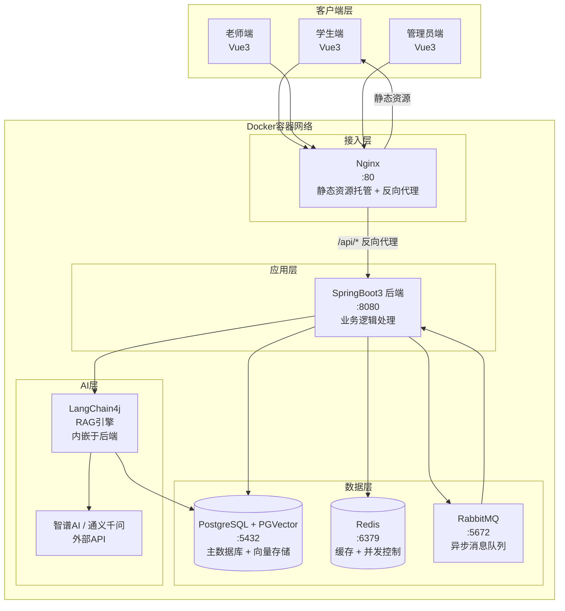
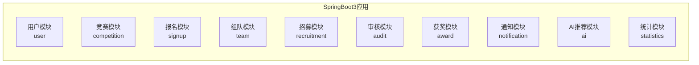
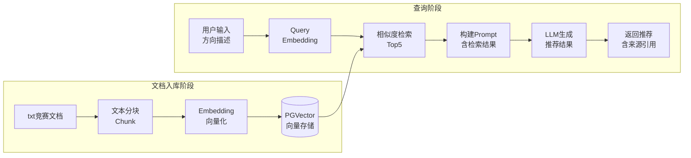
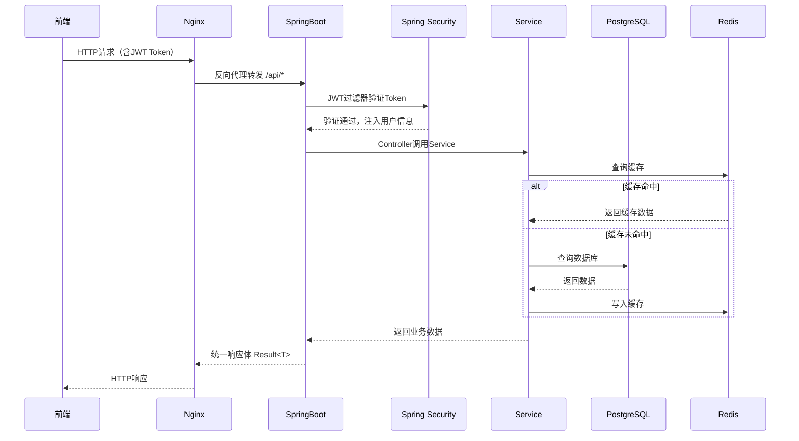
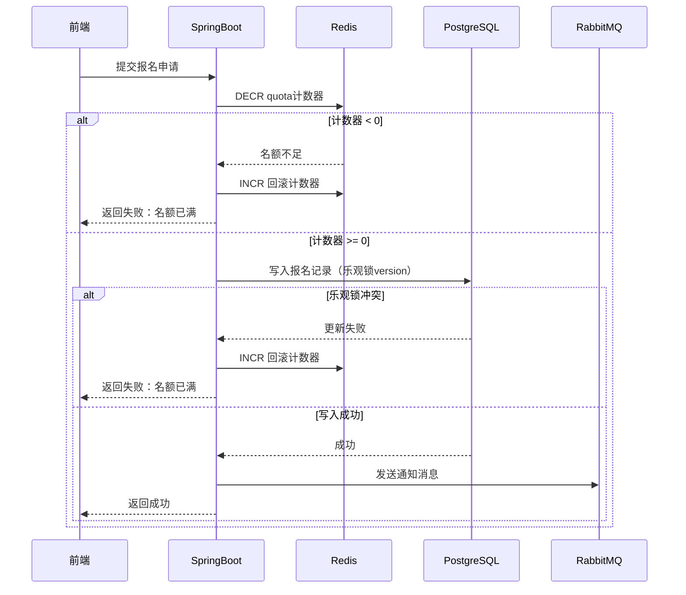
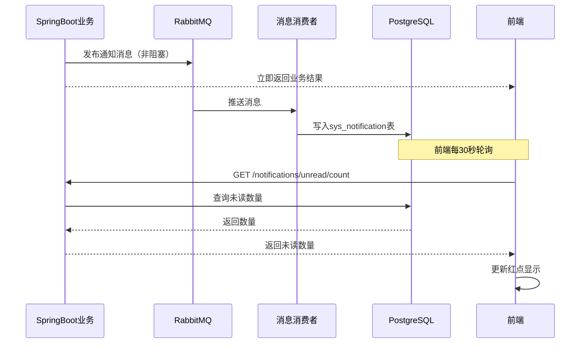
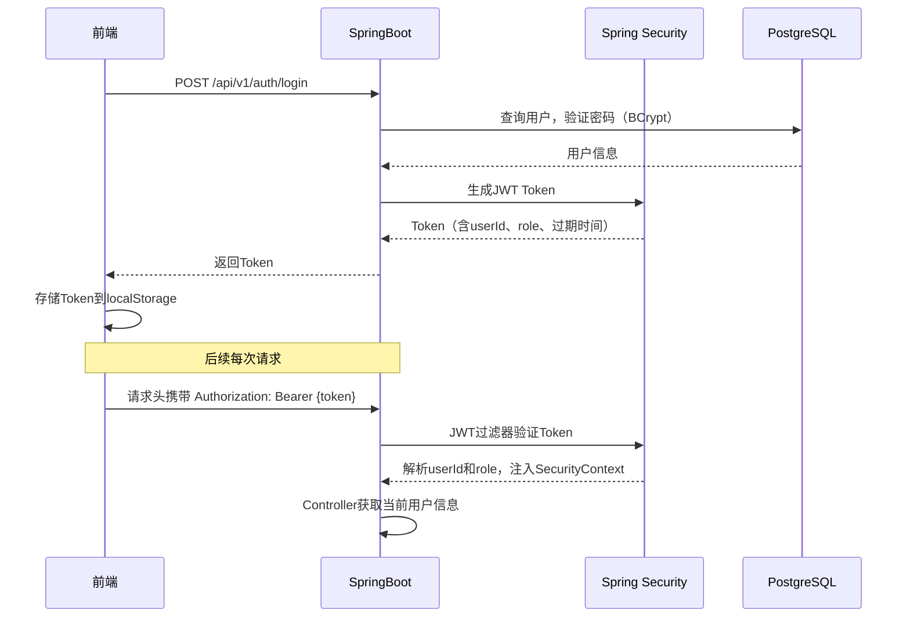
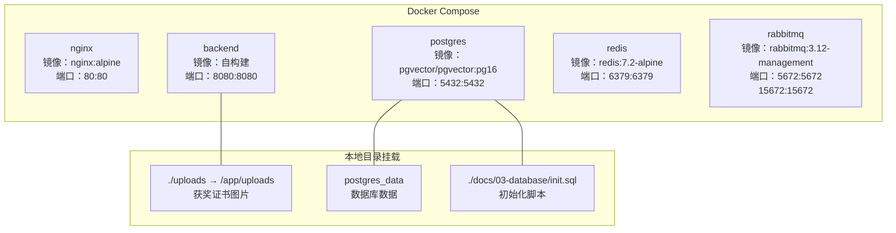

# 系统架构设计文档

> 版本：v1.0
> 创建人：负责人
> 创建日期：2026-03
> 维护人：负责人

---

## 一、架构概述

### 1.1 设计目标

```
可用性：核心功能稳定运行，本地环境一键启动
安全性：JWT认证，接口级别权限控制
可扩展：业务模块低耦合，后续功能易于添加
可维护：代码分层清晰，文档完整
```

### 1.2 整体架构风格

```
前后端分离的单体应用架构

选择理由：
  单体应用开发效率高，调试方便
  满足课程要求的同时控制复杂度
  后续毕设阶段可按需拆分微服务
```

---

## 二、整体架构图



---

## 三、各层详细说明

### 3.1 客户端层

```
技术栈：Vue3 + Vite + TypeScript + Element Plus

三端共用同一套前端代码：
  根据登录用户的 role 字段区分展示内容
  student  → 学生端页面和菜单
  teacher  → 老师端页面和菜单
  admin    → 管理员端页面和菜单

路由权限控制：
  Vue Router 路由守卫
  未登录 → 跳转登录页
  角色不匹配 → 跳转403页面
```

### 3.2 接入层（Nginx）

```
职责：
  1. 托管前端静态文件（Vue3 build产物）
  2. 反向代理后端API（/api/* → 后端:8080）
  3. 处理跨域问题

Nginx配置核心逻辑：
  所有 /api/ 开头的请求 → 转发给后端
  其余请求 → 返回前端静态文件
  前端路由刷新处理 → try_files $uri /index.html
```

```nginx
# Nginx 核心配置
server {
    listen 80;

    # 托管前端静态文件
    location / {
        root /usr/share/nginx/html;
        try_files $uri $uri/ /index.html;
    }

    # 反向代理后端API
    location /api/ {
        proxy_pass http://backend:8080;
        proxy_set_header Host $host;
        proxy_set_header X-Real-IP $remote_addr;
    }
}
```

### 3.3 应用层（SpringBoot3）

```
技术栈：SpringBoot3 + Spring Security + JPA + LangChain4j

分层结构：
  Controller   → 接收请求，参数校验，返回响应
  Service      → 业务逻辑处理
  Repository   → 数据库操作
  Entity       → 数据库实体映射
  DTO          → 接口入参对象
  VO           → 接口出参对象

核心组件：
  Spring Security + JWT  → 认证与权限控制
  Spring Data JPA        → ORM数据库操作
  Spring AMQP            → RabbitMQ消息收发
  Spring Data Redis      → Redis操作
  LangChain4j            → RAG链路实现
  Knife4j                → 接口文档自动生成
```

**业务模块划分**



### 3.4 数据层

#### PostgreSQL + PGVector

```
用途：
  主数据库：存储所有业务数据
  PGVector扩展：存储文档向量，支持相似度检索

PGVector说明：
  PostgreSQL的向量扩展插件
  无需单独部署向量数据库
  直接在同一个PostgreSQL实例中使用
  支持cosine相似度检索

数据库：campus_competition
核心表：7张（详见数据库设计文档）
```

#### Redis

```
用途：
  1. 竞赛列表缓存
     key：competition:list:{status}:{page}
     TTL：5分钟

  2. 老师带队数量计数器（并发控制）
     key：teacher:quota:{teacherId}:{competitionId}
     value：当前带队数量
     TTL：永久（竞赛结束后清除）

  3. 用户Token存储
     key：token:{userId}
     value：token信息
     TTL：2小时

  4. 竞赛名额计数器
     key：competition:quota:{competitionId}
     value：已报名数量
     TTL：永久（竞赛结束后清除）
```

#### RabbitMQ

```
用途：
  异步处理所有消息通知
  解耦核心业务和通知推送

队列设计：
  notification.queue  → 处理所有类型的通知消息

消息流转：
  业务操作完成
    → 发送消息到 notification.queue
    → Consumer消费消息
    → 写入 sys_notification 表
    → 前端轮询获取未读通知
```

### 3.5 AI层（LangChain4j + RAG）

```
内嵌于SpringBoot3后端，不单独部署

组件：
  LangChain4j   → RAG框架，管理检索和生成链路
  PGVector      → 向量存储（复用PostgreSQL）
  外部LLM API   → 智谱AI GLM 或 通义千问

RAG完整链路：
```



---

## 四、请求处理流程

### 4.1 普通请求流程



### 4.2 并发控制流程（报名/带队）



### 4.3 异步通知流程



---

## 五、安全架构

### 5.1 认证流程



### 5.2 权限控制

```
实现方式：Spring Security + 自定义注解

接口级别控制：
  @PreAuthorize("hasRole('ADMIN')")          → 仅管理员
  @PreAuthorize("hasRole('TEACHER')")        → 仅老师
  @PreAuthorize("hasAnyRole('ADMIN','TEACHER')") → 管理员或老师
  @PreAuthorize("hasAnyRole('ADMIN','STUDENT')") → 管理员或学生

数据级别控制（在Service层手动判断）：
  老师只能审核分配给自己的报名
  队长才能提交审核和管理队伍
  只有发布人或管理员能编辑竞赛
```

### 5.3 安全规则

```
密码：BCrypt加密存储，不可逆
Token：
  有效期2小时
  过期后前端跳转登录页
  不同用户Token相互独立
接口：
  所有 /api/* 接口（除login和register）必须携带Token
  Token无效返回401
  权限不足返回403
```

---

## 六、部署架构

### 6.1 Docker容器规划



### 6.2 容器启动顺序

```
depends_on 依赖关系：

postgres ──→ backend ──→ nginx
redis    ──→ backend
rabbitmq ──→ backend
```

### 6.3 docker-compose.yml

```yaml
version: '3.8'

services:
  # PostgreSQL + PGVector
  postgres:
    image: pgvector/pgvector:pg16
    container_name: competition-postgres
    environment:
      POSTGRES_DB: campus_competition
      POSTGRES_USER: competition
      POSTGRES_PASSWORD: competition123
    ports:
      - "5432:5432"
    volumes:
      - postgres_data:/var/lib/postgresql/data
      - ./docs/03-database/init.sql:/docker-entrypoint-initdb.d/init.sql
    restart: unless-stopped
    healthcheck:
      test: ["CMD-SHELL", "pg_isready -U competition"]
      interval: 10s
      timeout: 5s
      retries: 5

  # Redis
  redis:
    image: redis:7.2-alpine
    container_name: competition-redis
    ports:
      - "6379:6379"
    command: redis-server --requirepass redis123
    restart: unless-stopped
    healthcheck:
      test: ["CMD", "redis-cli", "-a", "redis123", "ping"]
      interval: 10s
      timeout: 5s
      retries: 5

  # RabbitMQ
  rabbitmq:
    image: rabbitmq:3.12-management
    container_name: competition-rabbitmq
    environment:
      RABBITMQ_DEFAULT_USER: competition
      RABBITMQ_DEFAULT_PASS: competition123
    ports:
      - "5672:5672"
      - "15672:15672"
    restart: unless-stopped
    healthcheck:
      test: ["CMD", "rabbitmq-diagnostics", "ping"]
      interval: 10s
      timeout: 5s
      retries: 5

  # SpringBoot后端
  backend:
    build:
      context: ./backend
      dockerfile: Dockerfile
    container_name: competition-backend
    environment:
      SPRING_PROFILES_ACTIVE: prod
      DB_HOST: postgres
      DB_PORT: 5432
      DB_NAME: campus_competition
      DB_USERNAME: competition
      DB_PASSWORD: competition123
      REDIS_HOST: redis
      REDIS_PORT: 6379
      REDIS_PASSWORD: redis123
      RABBITMQ_HOST: rabbitmq
      RABBITMQ_PORT: 5672
      RABBITMQ_USERNAME: competition
      RABBITMQ_PASSWORD: competition123
    ports:
      - "8080:8080"
    volumes:
      - ./uploads:/app/uploads
    depends_on:
      postgres:
        condition: service_healthy
      redis:
        condition: service_healthy
      rabbitmq:
        condition: service_healthy
    restart: unless-stopped

  # Nginx + 前端
  nginx:
    build:
      context: ./frontend
      dockerfile: Dockerfile
    container_name: competition-nginx
    ports:
      - "80:80"
    depends_on:
      - backend
    restart: unless-stopped

volumes:
  postgres_data:
```

### 6.4 Dockerfile

**后端 Dockerfile**

```dockerfile
# backend/Dockerfile

# 构建阶段
FROM maven:3.9-amazoncorretto-21 AS builder
WORKDIR /app
COPY pom.xml .
# 先下载依赖（利用Docker缓存层）
RUN mvn dependency:go-offline -B
COPY src ./src
RUN mvn package -DskipTests

# 运行阶段
FROM amazoncorretto:21-alpine
WORKDIR /app
COPY --from=builder /app/target/*.jar app.jar

# 创建上传目录
RUN mkdir -p /app/uploads

EXPOSE 8080
ENTRYPOINT ["java", "-jar", "app.jar"]
```

**前端 Dockerfile**

```dockerfile
# frontend/Dockerfile

# 构建阶段
FROM node:20-alpine AS builder
WORKDIR /app
COPY package*.json .
RUN npm ci
COPY . .
RUN npm run build

# 运行阶段
FROM nginx:alpine
# 复制前端构建产物
COPY --from=builder /app/dist /usr/share/nginx/html
# 复制Nginx配置
COPY nginx.conf /etc/nginx/conf.d/default.conf

EXPOSE 80
```

**frontend/nginx.conf**

```nginx
server {
    listen 80;
    server_name localhost;

    # 前端静态文件
    location / {
        root /usr/share/nginx/html;
        index index.html;
        # 支持Vue Router的history模式
        try_files $uri $uri/ /index.html;
    }

    # 反向代理后端API
    location /api/ {
        proxy_pass http://backend:8080;
        proxy_set_header Host $host;
        proxy_set_header X-Real-IP $remote_addr;
        proxy_set_header X-Forwarded-For $proxy_add_x_forwarded_for;
        # 超时配置
        proxy_connect_timeout 60s;
        proxy_read_timeout 60s;
    }

    # 静态资源缓存
    location ~* \.(js|css|png|jpg|jpeg|gif|ico|svg)$ {
        expires 7d;
        add_header Cache-Control "public, no-transform";
    }
}
```

---

## 七、技术选型说明

| 技术 | 选型 | 理由 |
|------|------|------|
| 前端框架 | Vue3 + Vite | 团队熟悉，生态成熟，开发效率高 |
| UI组件库 | Element Plus | Vue3生态最完善的组件库 |
| 后端框架 | SpringBoot3 | 课程要求，Java生态最成熟 |
| 数据库 | PostgreSQL | 支持PGVector扩展，一个数据库解决关系型和向量存储 |
| 向量存储 | PGVector | 复用PostgreSQL，无需单独部署向量数据库 |
| 缓存 | Redis | 缓存+并发控制双重用途，成熟稳定 |
| 消息队列 | RabbitMQ | 轻量级，适合中小规模，管理界面友好 |
| 权限 | Spring Security + JWT | SpringBoot生态原生支持，无状态认证 |
| AI框架 | LangChain4j | Java生态的RAG框架，与SpringBoot集成方便 |
| 容器化 | Docker + Compose | 一键启动所有服务，环境一致性 |
| 接口文档 | Knife4j | SpringBoot生态，注解自动生成文档 |

---

## 八、本地启动说明

```bash
# 前提：已安装 Docker Desktop 并启动

# 1. 克隆项目
git clone git@github.com:你的用户名/campus-competition-platform.git
cd campus-competition-platform

# 2. 一键启动所有服务
docker compose up -d

# 3. 等待所有服务启动（约2-3分钟）
docker compose ps
# 确认所有服务状态为 running

# 4. 访问服务
# 前端：http://localhost
# 后端接口文档：http://localhost:8080/doc.html
# RabbitMQ管理台：http://localhost:15672

# 5. 停止所有服务
docker compose stop

# 6. 查看日志
docker compose logs backend
docker compose logs postgres
```

---

## 九、开发环境 vs 生产环境

| 配置项 | 开发环境 | 生产环境（Docker）|
|--------|----------|-----------------|
| 前端访问 | http://localhost:5173 | http://localhost |
| 后端访问 | http://localhost:8080 | 通过Nginx代理 |
| 跨域处理 | 后端配置CORS | Nginx反向代理，无跨域 |
| 数据库 | Docker容器 | Docker容器 |
| 配置文件 | application-dev.yml | application-prod.yml |
| 日志级别 | DEBUG | INFO |