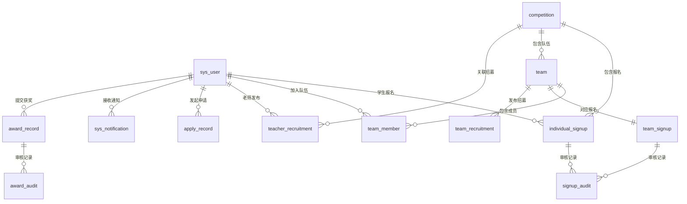

# 数据库设计文档

> 版本：v1.0
> 创建人：负责人
> 创建日期：2026-04
> 数据库：PostgreSQL 16 + PGVector
> 维护人：负责人

---

## 一、数据库概览

### 1.1 表清单

| 序号 | 表名 | 说明 | 核心关联 |
|------|------|------|----------|
| 1 | sys_user | 用户表 | 所有业务表的基础 |
| 2 | competition | 竞赛表 | 报名/招募的主体 |
| 3 | individual_signup | 个人赛报名表 | 多对一→user、competition |
| 4 | team | 队伍表 | 多对一→competition |
| 5 | team_member | 队伍成员表 | 多对多→user↔team |
| 6 | team_signup | 团队赛报名表 | 多对一→team、competition |
| 7 | teacher_recruitment | 老师招募帖表 | 多对一→user、competition |
| 8 | team_recruitment | 学生组队招募帖表 | 多对一→team、competition |
| 9 | apply_record | 申请记录表 | 多对一→user |
| 10 | signup_audit | 报名审核记录表 | 多对一→user |
| 11 | award_record | 获奖记录表 | 多对一→user、competition |
| 12 | award_audit | 获奖审核记录表 | 多对一→award_record |
| 13 | sys_notification | 消息通知表 | 多对一→user |
| 14 | rag_document | AI知识库文档表 | 独立表 |

### 1.2 表关系总览



---

## 二、表结构详细说明

### 2.1 sys_user 用户表

**用途**：存储所有用户基础信息，角色区分学生/老师/管理员。

| 字段名 | 类型 | 必填 | 默认值 | 说明 |
|--------|------|------|--------|------|
| id | BIGSERIAL | 是 | 自增 | 主键 |
| username | VARCHAR(64) | 是 | - | 用户名，全局唯一 |
| password | VARCHAR(255) | 是 | - | BCrypt加密密码 |
| real_name | VARCHAR(32) | 是 | - | 真实姓名 |
| role | VARCHAR(16) | 是 | - | 角色：STUDENT/TEACHER/ADMIN |
| phone | VARCHAR(20) | 否 | NULL | 手机号 |
| email | VARCHAR(128) | 否 | NULL | 邮箱 |
| student_no | VARCHAR(32) | 否 | NULL | 学号，学生必填，全局唯一 |
| department | VARCHAR(64) | 否 | NULL | 院系 |
| title | VARCHAR(32) | 否 | NULL | 职称，老师专属 |
| avatar_url | VARCHAR(512) | 否 | NULL | 头像路径 |
| status | VARCHAR(16) | 是 | 'ACTIVE' | 账号状态：ACTIVE/DISABLED |
| created_at | TIMESTAMPTZ | 是 | NOW() | 创建时间 |
| updated_at | TIMESTAMPTZ | 是 | NOW() | 更新时间 |

**索引**

| 索引名 | 类型 | 字段 | 说明 |
|--------|------|------|------|
| pk_sys_user | PRIMARY | id | 主键 |
| uk_sys_user_username | UNIQUE | username | 用户名唯一 |
| uk_sys_user_student_no | UNIQUE | student_no | 学号唯一 |
| idx_sys_user_role | NORMAL | role | 按角色查询 |

**业务说明**

```
1. student_no 仅学生填写，老师和管理员为NULL
2. title 仅老师填写，如：讲师/副教授/教授
3. password 使用BCrypt加密，不可逆
4. 管理员账号由初始化脚本创建，不开放注册
```

---

### 2.2 competition 竞赛表

**用途**：存储竞赛基本信息，是报名和招募的核心主体。

| 字段名 | 类型 | 必填 | 默认值 | 说明 |
|--------|------|------|--------|------|
| id | BIGSERIAL | 是 | 自增 | 主键 |
| title | VARCHAR(128) | 是 | - | 竞赛名称 |
| type | VARCHAR(16) | 是 | - | 竞赛类型：INDIVIDUAL/TEAM |
| organizer | VARCHAR(128) | 是 | - | 主办方 |
| requirement | TEXT | 否 | NULL | 参赛要求 |
| signup_start | TIMESTAMPTZ | 是 | - | 报名开始时间 |
| signup_end | TIMESTAMPTZ | 是 | - | 报名截止时间 |
| competition_start | TIMESTAMPTZ | 否 | NULL | 比赛开始时间 |
| competition_end | TIMESTAMPTZ | 否 | NULL | 比赛结束时间 |
| has_quota | BOOLEAN | 是 | FALSE | 是否有名额限制 |
| max_quota | INT | 否 | NULL | 名额上限，has_quota为TRUE时必填 |
| enrolled_count | INT | 是 | 0 | 已报名数量 |
| min_team_size | INT | 否 | NULL | 最少队伍人数，团队赛必填 |
| max_team_size | INT | 否 | NULL | 最多队伍人数，团队赛必填 |
| max_teach_quota | INT | 否 | NULL | 每位老师最多带队数，NULL表示不限制 |
| description | TEXT | 否 | NULL | 竞赛详情 |
| attachment_url | VARCHAR(512) | 否 | NULL | 附件相对路径 |
| status | VARCHAR(16) | 是 | 'UPCOMING' | 竞赛状态（见枚举） |
| created_by | BIGINT | 是 | - | 发布人ID，关联sys_user.id |
| version | INT | 是 | 0 | 乐观锁版本号 |
| created_at | TIMESTAMPTZ | 是 | NOW() | 创建时间 |
| updated_at | TIMESTAMPTZ | 是 | NOW() | 更新时间 |

**索引**

| 索引名 | 类型 | 字段 | 说明 |
|--------|------|------|------|
| pk_competition | PRIMARY | id | 主键 |
| idx_competition_status | NORMAL | status | 按状态查询 |
| idx_competition_type | NORMAL | type | 按类型查询 |
| idx_competition_created_by | NORMAL | created_by | 按发布人查询 |
| idx_competition_signup_end | NORMAL | signup_end | 按截止时间排序 |

**业务说明**

```
1. status 根据时间自动流转，定时任务每分钟检查
2. enrolled_count 由Redis计数器维护，定期同步到数据库
3. version 用于乐观锁并发控制，每次更新+1
4. min_team_size/max_team_size 仅团队赛有值
5. max_teach_quota 为NULL时表示老师带队不限数量
```

---

### 2.3 individual_signup 个人赛报名表

**用途**：记录个人赛的报名申请，从学生提交到管理员审核的全过程。

| 字段名 | 类型 | 必填 | 默认值 | 说明 |
|--------|------|------|--------|------|
| id | BIGSERIAL | 是 | 自增 | 主键 |
| competition_id | BIGINT | 是 | - | 竞赛ID，关联competition.id |
| student_id | BIGINT | 是 | - | 学生ID，关联sys_user.id |
| teacher_id | BIGINT | 是 | - | 指导老师ID，关联sys_user.id |
| motivation | TEXT | 否 | NULL | 参赛动机 |
| introduction | TEXT | 否 | NULL | 个人简介 |
| status | VARCHAR(16) | 是 | 'DRAFT' | 报名状态（见枚举） |
| reject_reason | TEXT | 否 | NULL | 驳回原因，管理员填写 |
| submitted_at | TIMESTAMPTZ | 否 | NULL | 提交管理员审核的时间 |
| created_at | TIMESTAMPTZ | 是 | NOW() | 创建时间 |
| updated_at | TIMESTAMPTZ | 是 | NOW() | 更新时间 |

**索引**

| 索引名 | 类型 | 字段 | 说明 |
|--------|------|------|------|
| pk_individual_signup | PRIMARY | id | 主键 |
| uk_individual_signup | UNIQUE | competition_id, student_id | 同一竞赛同一学生只能报名一次 |
| idx_individual_signup_student | NORMAL | student_id | 查询学生的报名记录 |
| idx_individual_signup_teacher | NORMAL | teacher_id | 查询老师的带队记录 |
| idx_individual_signup_status | NORMAL | status | 按状态筛选 |

**状态流转**

```
DRAFT          → 老师已同意指导，待学生提交审核
    ↓ 学生提交
PENDING        → 待管理员审核
    ↓                    ↓
APPROVED       →      REJECTED → 驳回，退回给老师
                          ↓ 老师通知学生修改
                      RESUBMITTED → 修改后重新提交
                          ↓
                       PENDING（重新进入审核队列）
```

---

### 2.4 team 队伍表

**用途**：记录团队赛的队伍信息，包含队伍基本信息和指导老师。

| 字段名 | 类型 | 必填 | 默认值 | 说明 |
|--------|------|------|--------|------|
| id | BIGSERIAL | 是 | 自增 | 主键 |
| competition_id | BIGINT | 是 | - | 关联竞赛ID，关联competition.id |
| team_name | VARCHAR(64) | 是 | - | 队伍名称 |
| leader_id | BIGINT | 是 | - | 队长ID，关联sys_user.id |
| teacher_id | BIGINT | 否 | NULL | 指导老师ID，关联sys_user.id |
| teacher_confirmed | BOOLEAN | 是 | FALSE | 老师是否已确认带队 |
| member_count | INT | 是 | 1 | 当前成员数量（含队长） |
| status | VARCHAR(16) | 是 | 'FORMING' | 队伍状态（见枚举） |
| created_at | TIMESTAMPTZ | 是 | NOW() | 创建时间 |
| updated_at | TIMESTAMPTZ | 是 | NOW() | 更新时间 |

**索引**

| 索引名 | 类型 | 字段 | 说明 |
|--------|------|------|------|
| pk_team | PRIMARY | id | 主键 |
| idx_team_competition | NORMAL | competition_id | 按竞赛查询队伍 |
| idx_team_leader | NORMAL | leader_id | 按队长查询 |
| idx_team_teacher | NORMAL | teacher_id | 按老师查询带队情况 |
| idx_team_status | NORMAL | status | 按状态查询 |

**队伍状态枚举**

| 状态值 | 说明 |
|--------|------|
| FORMING | 组建中，招募队员阶段 |
| FULL | 人数已满，等待提交审核 |
| SUBMITTED | 已提交管理员审核 |
| APPROVED | 审核通过，报名生效 |
| REJECTED | 审核驳回 |
| DISMISSED | 已解散 |

**业务说明**

```
1. teacher_id 可以为NULL，表示尚未选定指导老师
2. teacher_confirmed 为TRUE后才允许发布组队招募帖
3. member_count 随队员加入/退出实时更新
4. 只有status为FORMING时，队长才能踢人、队员才能退出
5. status为SUBMITTED后，成员变动被禁止
```

---

### 2.5 team_member 队伍成员表

**用途**：记录队伍和成员的多对多关系，队长也作为成员存储。

| 字段名 | 类型 | 必填 | 默认值 | 说明 |
|--------|------|------|--------|------|
| id | BIGSERIAL | 是 | 自增 | 主键 |
| team_id | BIGINT | 是 | - | 队伍ID，关联team.id |
| student_id | BIGINT | 是 | - | 学生ID，关联sys_user.id |
| role | VARCHAR(16) | 是 | 'MEMBER' | 角色：LEADER/MEMBER |
| joined_at | TIMESTAMPTZ | 是 | NOW() | 加入时间 |
| created_at | TIMESTAMPTZ | 是 | NOW() | 创建时间 |
| updated_at | TIMESTAMPTZ | 是 | NOW() | 更新时间 |

**索引**

| 索引名 | 类型 | 字段 | 说明 |
|--------|------|------|------|
| pk_team_member | PRIMARY | id | 主键 |
| uk_team_member | UNIQUE | team_id, student_id | 同一队伍同一学生只能有一条记录 |
| idx_team_member_team | NORMAL | team_id | 查询队伍所有成员 |
| idx_team_member_student | NORMAL | student_id | 查询学生加入的队伍 |

**业务说明**

```
1. 队长创建队伍时，自动插入一条role=LEADER的记录
2. 同一竞赛下，一个学生只能加入一支队伍
   （通过查询team_member关联competition_id来校验）
3. 成员退出或被踢出时，直接删除该记录
4. 队伍解散时，删除所有成员记录
```

---

### 2.6 team_signup 团队赛报名表

**用途**：记录团队赛的报名申请，一支队伍对应一条报名记录。

| 字段名 | 类型 | 必填 | 默认值 | 说明 |
|--------|------|------|--------|------|
| id | BIGSERIAL | 是 | 自增 | 主键 |
| competition_id | BIGINT | 是 | - | 竞赛ID，关联competition.id |
| team_id | BIGINT | 是 | - | 队伍ID，关联team.id |
| teacher_id | BIGINT | 是 | - | 指导老师ID，关联sys_user.id |
| status | VARCHAR(16) | 是 | 'PENDING' | 报名状态（同individual_signup） |
| reject_reason | TEXT | 否 | NULL | 驳回原因，管理员填写 |
| submitted_at | TIMESTAMPTZ | 否 | NULL | 提交管理员审核的时间 |
| created_at | TIMESTAMPTZ | 是 | NOW() | 创建时间 |
| updated_at | TIMESTAMPTZ | 是 | NOW() | 更新时间 |

**索引**

| 索引名 | 类型 | 字段 | 说明 |
|--------|------|------|------|
| pk_team_signup | PRIMARY | id | 主键 |
| uk_team_signup | UNIQUE | competition_id, team_id | 同一竞赛同一队伍只能有一条报名 |
| idx_team_signup_team | NORMAL | team_id | 按队伍查询 |
| idx_team_signup_teacher | NORMAL | teacher_id | 按老师查询带队报名 |
| idx_team_signup_status | NORMAL | status | 按状态筛选 |

**业务说明**

```
1. 队长提交审核时创建该记录
2. status与individual_signup保持相同枚举
3. 驳回后退回给老师，老师通知队长修改
4. 队长重新提交时更新status为RESUBMITTED
```

---

### 2.7 teacher_recruitment 老师招募帖表

**用途**：老师发布的招募帖，面向学生招募参赛成员，个人赛和团队赛均可。

| 字段名 | 类型 | 必填 | 默认值 | 说明 |
|--------|------|------|--------|------|
| id | BIGSERIAL | 是 | 自增 | 主键 |
| competition_id | BIGINT | 是 | - | 关联竞赛ID，关联competition.id |
| teacher_id | BIGINT | 是 | - | 发布老师ID，关联sys_user.id |
| recruit_count | INT | 是 | - | 招募人数 |
| current_count | INT | 是 | 0 | 当前已加入人数 |
| requirement | TEXT | 否 | NULL | 对学生的要求描述 |
| deadline | TIMESTAMPTZ | 否 | NULL | 招募截止时间 |
| status | VARCHAR(16) | 是 | 'OPEN' | 状态：OPEN/FULL/CLOSED |
| created_at | TIMESTAMPTZ | 是 | NOW() | 创建时间 |
| updated_at | TIMESTAMPTZ | 是 | NOW() | 更新时间 |

**索引**

| 索引名 | 类型 | 字段 | 说明 |
|--------|------|------|------|
| pk_teacher_recruitment | PRIMARY | id | 主键 |
| idx_teacher_recruitment_competition | NORMAL | competition_id | 按竞赛查询招募帖 |
| idx_teacher_recruitment_teacher | NORMAL | teacher_id | 按老师查询发布的招募帖 |
| idx_teacher_recruitment_status | NORMAL | status | 按状态筛选 |

**业务说明**

```
1. current_count 达到 recruit_count 时，status自动改为FULL
2. 竞赛报名截止（signup_end）后，status自动改为CLOSED
3. 老师可以手动关闭招募帖（status→CLOSED）
4. 发布前检查老师带队数量是否已达上限
```

---

### 2.8 team_recruitment 学生组队招募帖表

**用途**：团队赛中，队长在老师确认带队后发布的招募帖，用于寻找队友。

| 字段名 | 类型 | 必填 | 默认值 | 说明 |
|--------|------|------|--------|------|
| id | BIGSERIAL | 是 | 自增 | 主键 |
| competition_id | BIGINT | 是 | - | 关联竞赛ID，关联competition.id |
| team_id | BIGINT | 是 | - | 关联队伍ID，关联team.id |
| leader_id | BIGINT | 是 | - | 队长ID，关联sys_user.id |
| recruit_count | INT | 是 | - | 还需要几人 |
| current_count | INT | 是 | 0 | 当前已申请加入人数 |
| requirement | TEXT | 否 | NULL | 对队友的要求描述 |
| deadline | TIMESTAMPTZ | 否 | NULL | 招募截止时间 |
| status | VARCHAR(16) | 是 | 'OPEN' | 状态：OPEN/FULL/CLOSED |
| created_at | TIMESTAMPTZ | 是 | NOW() | 创建时间 |
| updated_at | TIMESTAMPTZ | 是 | NOW() | 更新时间 |

**索引**

| 索引名 | 类型 | 字段 | 说明 |
|--------|------|------|------|
| pk_team_recruitment | PRIMARY | id | 主键 |
| idx_team_recruitment_competition | NORMAL | competition_id | 按竞赛查询 |
| idx_team_recruitment_team | NORMAL | team_id | 按队伍查询 |
| idx_team_recruitment_leader | NORMAL | leader_id | 按队长查询 |
| idx_team_recruitment_status | NORMAL | status | 按状态筛选 |

**业务说明**

```
1. 前提：team.teacher_confirmed = TRUE 才能发布
2. 队伍人数达到 competition.max_team_size 时，status自动改为FULL
3. 竞赛报名截止后，status自动改为CLOSED
4. 只有队长（leader_id）可以发布和关闭
```

---

### 2.9 apply_record 申请记录表

**用途**：统一记录所有类型的申请，包含学生向老师发指导申请、带队申请、申请加入招募帖、队长邀请队友。

| 字段名 | 类型 | 必填 | 默认值 | 说明 |
|--------|------|------|--------|------|
| id | BIGSERIAL | 是 | 自增 | 主键 |
| type | VARCHAR(32) | 是 | - | 申请类型（见枚举） |
| applicant_id | BIGINT | 是 | - | 申请发起人ID，关联sys_user.id |
| receiver_id | BIGINT | 是 | - | 申请接收人ID，关联sys_user.id |
| biz_id | BIGINT | 是 | - | 关联业务ID（见说明） |
| introduction | TEXT | 否 | NULL | 申请人自我介绍 |
| motivation | TEXT | 否 | NULL | 申请理由 |
| status | VARCHAR(16) | 是 | 'PENDING' | 状态：PENDING/APPROVED/REJECTED |
| reject_reason | TEXT | 否 | NULL | 拒绝原因 |
| created_at | TIMESTAMPTZ | 是 | NOW() | 创建时间 |
| updated_at | TIMESTAMPTZ | 是 | NOW() | 更新时间 |

**索引**

| 索引名 | 类型 | 字段 | 说明 |
|--------|------|------|------|
| pk_apply_record | PRIMARY | id | 主键 |
| idx_apply_record_type_biz | NORMAL | type, biz_id | 按业务查询申请列表 |
| idx_apply_record_applicant | NORMAL | applicant_id | 查询我发起的申请 |
| idx_apply_record_receiver | NORMAL | receiver_id | 查询我收到的申请 |
| idx_apply_record_status | NORMAL | status | 按状态筛选 |

**申请类型枚举与biz_id说明**

| type值 | 含义 | applicant | receiver | biz_id指向 |
|--------|------|-----------|----------|------------|
| INDIVIDUAL_GUIDE | 学生向老师申请个人赛指导 | 学生 | 老师 | competition.id |
| TEAM_GUIDE | 队长向老师申请团队带队 | 队长 | 老师 | team.id |
| TEACHER_RECRUIT_APPLY | 学生申请加入老师招募帖 | 学生 | 老师 | teacher_recruitment.id |
| TEAM_RECRUIT_APPLY | 学生申请加入队伍招募帖 | 学生 | 队长 | team_recruitment.id |
| TEAM_INVITE | 队长邀请学生加入队伍 | 队长 | 被邀请学生 | team.id |

**业务说明**

```
1. INDIVIDUAL_GUIDE申请通过后：
   创建individual_signup记录（status=DRAFT）

2. TEAM_GUIDE申请通过后：
   更新team.teacher_id和teacher_confirmed=TRUE
   老师带队计数器+1（Redis）

3. TEACHER_RECRUIT_APPLY申请通过后：
   根据竞赛类型决定后续流程
   个人赛：创建individual_signup记录
   团队赛：将学生加入老师管理的队伍

4. TEAM_RECRUIT_APPLY申请通过后：
   插入team_member记录
   更新team.member_count+1
   更新team_recruitment.current_count+1

5. TEAM_INVITE申请通过后：
   插入team_member记录
   更新team.member_count+1

6. 同一业务同一申请人不能重复申请
   通过联合查询 type + biz_id + applicant_id + status=PENDING 校验
```

---

### 2.10 signup_audit 报名审核记录表

**用途**：记录管理员对报名申请的每次审核操作，包含个人赛和团队赛。

| 字段名 | 类型 | 必填 | 默认值 | 说明 |
|--------|------|------|--------|------|
| id | BIGSERIAL | 是 | 自增 | 主键 |
| biz_type | VARCHAR(16) | 是 | - | 业务类型：INDIVIDUAL/TEAM |
| biz_id | BIGINT | 是 | - | 关联报名ID |
| auditor_id | BIGINT | 是 | - | 审核人ID，关联sys_user.id |
| result | VARCHAR(16) | 是 | - | 审核结果：APPROVED/REJECTED |
| reject_reason | TEXT | 否 | NULL | 驳回原因 |
| created_at | TIMESTAMPTZ | 是 | NOW() | 审核时间 |

**索引**

| 索引名 | 类型 | 字段 | 说明 |
|--------|------|------|------|
| pk_signup_audit | PRIMARY | id | 主键 |
| idx_signup_audit_biz | NORMAL | biz_type, biz_id | 查询某报名的审核历史 |
| idx_signup_audit_auditor | NORMAL | auditor_id | 查询审核人的操作记录 |

**biz_id说明**

```
biz_type = INDIVIDUAL → biz_id 指向 individual_signup.id
biz_type = TEAM       → biz_id 指向 team_signup.id
```

**业务说明**

```
1. 每次审核操作都插入一条新记录（保留完整审核历史）
2. 同一报名可能有多条审核记录（驳回后重新提交再审核）
3. 审核通过时：更新对应报名表的status为APPROVED
4. 审核驳回时：更新对应报名表的status为REJECTED
                同时记录reject_reason
```

---

### 2.11 award_record 获奖记录表

**用途**：记录学生提交的获奖信息，等待管理员审核确认后正式入库展示。

| 字段名 | 类型 | 必填 | 默认值 | 说明 |
|--------|------|------|--------|------|
| id | BIGSERIAL | 是 | 自增 | 主键 |
| competition_id | BIGINT | 是 | - | 竞赛ID，关联competition.id |
| submitter_id | BIGINT | 是 | - | 提交人ID，关联sys_user.id |
| biz_type | VARCHAR(16) | 是 | - | 报名类型：INDIVIDUAL/TEAM |
| biz_id | BIGINT | 是 | - | 关联报名ID |
| award_level | VARCHAR(32) | 是 | - | 奖项等级（见枚举） |
| award_name | VARCHAR(128) | 是 | - | 奖项名称，如"全国一等奖" |
| certificate_url | VARCHAR(512) | 是 | - | 证书图片相对路径 |
| award_date | DATE | 是 | - | 获奖日期 |
| status | VARCHAR(16) | 是 | 'PENDING' | 状态：PENDING/APPROVED/REJECTED |
| created_at | TIMESTAMPTZ | 是 | NOW() | 创建时间 |
| updated_at | TIMESTAMPTZ | 是 | NOW() | 更新时间 |

**索引**

| 索引名 | 类型 | 字段 | 说明 |
|--------|------|------|------|
| pk_award_record | PRIMARY | id | 主键 |
| uk_award_record | UNIQUE | biz_type, biz_id | 同一报名只能有一条获奖记录 |
| idx_award_record_competition | NORMAL | competition_id | 按竞赛查询获奖 |
| idx_award_record_submitter | NORMAL | submitter_id | 按提交人查询 |
| idx_award_record_status | NORMAL | status | 按状态筛选 |

**奖项等级枚举**

| 枚举值 | 说明 |
|--------|------|
| NATIONAL_FIRST | 国家级一等奖 |
| NATIONAL_SECOND | 国家级二等奖 |
| NATIONAL_THIRD | 国家级三等奖 |
| PROVINCIAL_FIRST | 省级一等奖 |
| PROVINCIAL_SECOND | 省级二等奖 |
| PROVINCIAL_THIRD | 省级三等奖 |
| OTHER | 其他 |

**业务说明**

```
1. biz_type = INDIVIDUAL → biz_id 指向 individual_signup.id
   biz_type = TEAM       → biz_id 指向 team_signup.id
2. 团队赛获奖记录关联整支队伍，通过biz_id查team_signup
   再通过team_id查team_member获取所有成员
3. certificate_url存相对路径：/uploads/certificates/年/月/uuid.jpg
4. 驳回后可修改certificate_url等字段重新提交
```

---

### 2.12 award_audit 获奖审核记录表

**用途**：记录管理员对获奖记录的每次审核操作。

| 字段名 | 类型 | 必填 | 默认值 | 说明 |
|--------|------|------|--------|------|
| id | BIGSERIAL | 是 | 自增 | 主键 |
| award_record_id | BIGINT | 是 | - | 关联获奖记录ID，关联award_record.id |
| auditor_id | BIGINT | 是 | - | 审核人ID，关联sys_user.id |
| result | VARCHAR(16) | 是 | - | 审核结果：APPROVED/REJECTED |
| reject_reason | TEXT | 否 | NULL | 驳回原因 |
| created_at | TIMESTAMPTZ | 是 | NOW() | 审核时间 |

**索引**

| 索引名 | 类型 | 字段 | 说明 |
|--------|------|------|------|
| pk_award_audit | PRIMARY | id | 主键 |
| idx_award_audit_record | NORMAL | award_record_id | 查询某获奖记录的审核历史 |

---

### 2.13 sys_notification 消息通知表

**用途**：存储系统推送给用户的所有通知消息，由RabbitMQ消费者写入。

| 字段名 | 类型 | 必填 | 默认值 | 说明 |
|--------|------|------|--------|------|
| id | BIGSERIAL | 是 | 自增 | 主键 |
| receiver_id | BIGINT | 是 | - | 接收人ID，关联sys_user.id |
| type | VARCHAR(32) | 是 | - | 通知类型（见枚举） |
| title | VARCHAR(128) | 是 | - | 通知标题 |
| content | TEXT | 是 | - | 通知内容 |
| related_id | BIGINT | 否 | NULL | 关联业务ID，点击可跳转 |
| is_read | BOOLEAN | 是 | FALSE | 是否已读 |
| created_at | TIMESTAMPTZ | 是 | NOW() | 创建时间 |

**索引**

| 索引名 | 类型 | 字段 | 说明 |
|--------|------|------|------|
| pk_sys_notification | PRIMARY | id | 主键 |
| idx_notification_receiver_read | NORMAL | receiver_id, is_read | 查询未读通知（高频查询）|
| idx_notification_created_at | NORMAL | created_at | 按时间排序 |

**通知类型枚举**

| type值 | 说明 | 接收人 |
|--------|------|--------|
| APPLY_RECEIVED | 收到申请 | 老师/队长 |
| APPLY_APPROVED | 申请被同意 | 申请人 |
| APPLY_REJECTED | 申请被拒绝 | 申请人 |
| TEAM_INVITE | 收到队伍邀请 | 被邀请学生 |
| AUDIT_SUBMITTED | 有新报名待审核 | 管理员 |
| AUDIT_APPROVED | 报名审核通过 | 学生/队长 |
| AUDIT_REJECTED | 报名审核驳回 | 老师 |
| RESUBMIT_REQUIRED | 需要修改重新提交 | 学生/队长 |
| AWARD_SUBMITTED | 有新获奖记录待审核 | 管理员 |
| AWARD_APPROVED | 获奖记录审核通过 | 提交人 |
| AWARD_REJECTED | 获奖记录审核驳回 | 提交人 |

---

### 2.14 rag_document AI知识库文档表

**用途**：存储竞赛介绍文档的原始内容和向量表示，用于RAG检索。

| 字段名 | 类型 | 必填 | 默认值 | 说明 |
|--------|------|------|--------|------|
| id | BIGSERIAL | 是 | 自增 | 主键 |
| doc_name | VARCHAR(128) | 是 | - | 文档名称，如"蓝桥杯介绍" |
| competition_name | VARCHAR(128) | 是 | - | 对应竞赛名称 |
| chunk_index | INT | 是 | - | 分块序号，同一文档的第几块 |
| content | TEXT | 是 | - | 分块后的原始文本内容 |
| embedding | vector(1024) | 否 | NULL | 向量表示，由PGVector存储 |
| category | VARCHAR(32) | 否 | NULL | 竞赛类别标签，如算法/数学/创新 |
| created_at | TIMESTAMPTZ | 是 | NOW() | 创建时间 |

**索引**

| 索引名 | 类型 | 字段 | 说明 |
|--------|------|------|------|
| pk_rag_document | PRIMARY | id | 主键 |
| idx_rag_document_name | NORMAL | doc_name | 按文档名查询 |
| idx_rag_embedding | HNSW | embedding | 向量相似度检索（PGVector专用）|

**业务说明**

```
1. 向量维度1024对应 BGE-M3 模型的输出维度
   模型：BAAI/bge-m3
   如切换其他模型需同步修改维度并重新入库
2. HNSW索引是PGVector推荐的向量检索索引
   检索速度比暴力检索快很多
3. 一个txt文档会被分成多个chunk存储
   chunk_index记录顺序，便于还原上下文
4. embedding列在文档入库时由后端调用Embedding API填充
5. 初始数据：项目启动时执行脚本，将5-10个竞赛txt文件入库
```

---

## 三、全局枚举汇总

| 枚举名 | 值 | 说明 |
|--------|-----|------|
| UserRole | STUDENT / TEACHER / ADMIN | 用户角色 |
| UserStatus | ACTIVE / DISABLED | 账号状态 |
| CompetitionType | INDIVIDUAL / TEAM | 竞赛类型 |
| CompetitionStatus | UPCOMING / SIGNING / CLOSED / ONGOING / FINISHED / OFFLINE | 竞赛状态 |
| SignupStatus | DRAFT / PENDING / APPROVED / REJECTED / RESUBMITTED | 报名状态 |
| TeamStatus | FORMING / FULL / SUBMITTED / APPROVED / REJECTED / DISMISSED | 队伍状态 |
| RecruitmentStatus | OPEN / FULL / CLOSED | 招募帖状态 |
| ApplyType | INDIVIDUAL_GUIDE / TEAM_GUIDE / TEACHER_RECRUIT_APPLY / TEAM_RECRUIT_APPLY / TEAM_INVITE | 申请类型 |
| ApplyStatus | PENDING / APPROVED / REJECTED | 申请状态 |
| AuditBizType | INDIVIDUAL / TEAM | 审核业务类型 |
| AuditResult | APPROVED / REJECTED | 审核结果 |
| AwardLevel | NATIONAL_FIRST / NATIONAL_SECOND / NATIONAL_THIRD / PROVINCIAL_FIRST / PROVINCIAL_SECOND / PROVINCIAL_THIRD / OTHER | 奖项等级 |
| AwardStatus | PENDING / APPROVED / REJECTED | 获奖记录状态 |
| NotificationType | APPLY_RECEIVED / APPLY_APPROVED / APPLY_REJECTED / TEAM_INVITE / AUDIT_SUBMITTED / AUDIT_APPROVED / AUDIT_REJECTED / RESUBMIT_REQUIRED / AWARD_SUBMITTED / AWARD_APPROVED / AWARD_REJECTED | 通知类型 |

---

## 四、Redis数据结构设计

| Key格式 | 类型 | 说明 | TTL |
|---------|------|------|-----|
| competition:list:{status}:{page} | String | 竞赛列表缓存 | 5分钟 |
| competition:quota:{id} | String | 竞赛已报名数量计数器 | 永久 |
| teacher:quota:{teacherId}:{competitionId} | String | 老师带队数量计数器 | 永久 |
| token:{userId} | String | 用户Token缓存 | 2小时 |

---

## 五、注意事项

```
1. 所有时间字段统一使用 TIMESTAMPTZ（带时区）
   存储时统一为UTC，展示时前端转换为本地时间

2. 所有金额/数量字段使用INT，不使用FLOAT
   避免浮点数精度问题

3. 软删除策略：
   本项目大部分表不使用软删除
   以下情况直接物理删除：
     队员退出队伍（删除team_member记录）
     撤回申请（删除apply_record记录，仅PENDING状态可撤回）
   以下情况使用状态字段标记：
     竞赛下架（status=OFFLINE）
     队伍解散（status=DISMISSED）

4. 外键策略：
   数据库层面不设置外键约束
   由应用层（Service）保证数据一致性
   原因：外键约束影响并发性能，且灵活性差

5. 向量维度：
   rag_document.embedding 维度设置为1024
   Embedding模型：BAAI/bge-m3（硅基流动API）
   LLM模型：Qwen2.5-7B-Instruct（硅基流动API）
   API格式：OpenAI兼容，BaseURL：https://api.siliconflow.cn/v1
   如切换模型需同步修改维度并重新入库

6. 管理员初始账号
   用户名：admin
   密码：admin123456
   登录后建议第一时间修改密码

   HNSW向量索引
   注释掉了，原因：
   建表时没有数据，建空表的HNSW索引没有意义
   等第一批竞赛文档入库后再执行那条建索引的SQL

   触发器
   所有需要自动更新updated_at的表都加了触发器
   signup_audit/award_audit/sys_notification不需要
   因为这三张表的记录不会被修改

   ON CONFLICT
   admin账号插入用了ON CONFLICT DO NOTHING
   保证脚本重复执行不报错
```